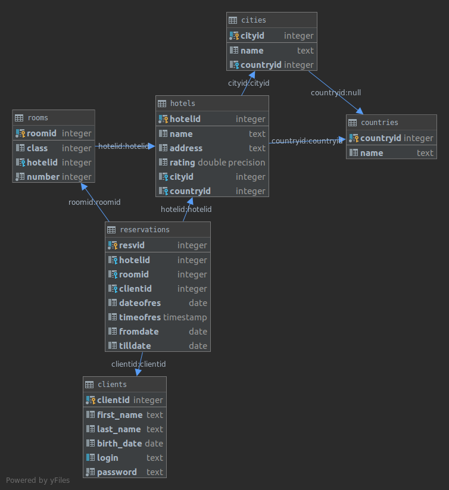
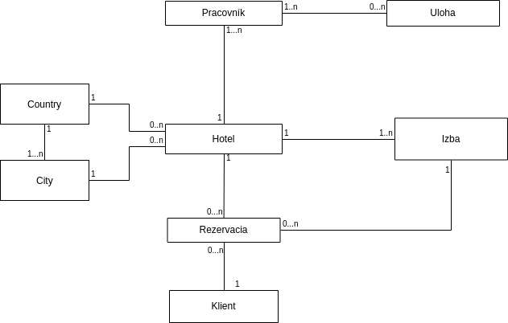
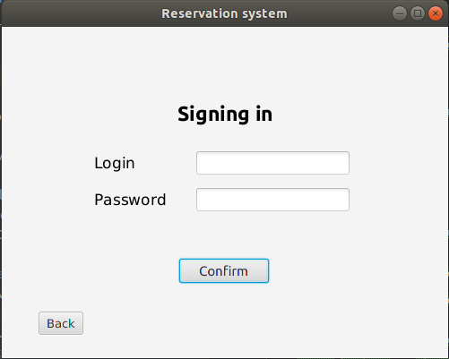
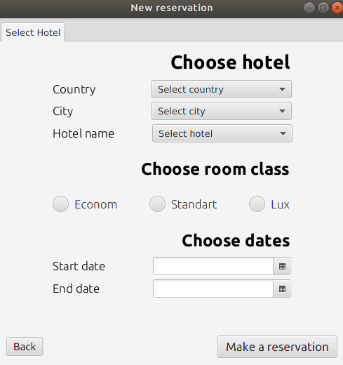
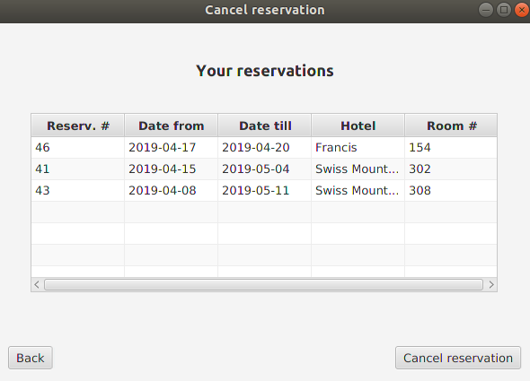
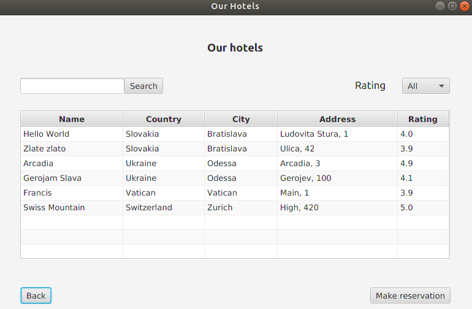

# Dokumentácia

##Zadanie
Vo vami zvolenom prostredí vytvorte databázovú aplikáciu, 
ktorá komplexne rieši päť vami zadefinovaných scenárov (prípadov použitia) 
vo vami zvolenej doméne tak, aby ste demonštrovali využitie relačnej databázy 
podľa pokynov uvedených nižšie. Presný rozsah a konkretizáciu scenárov si
dohodnete s Vašim cvičiacim na cvičení. Projekt sa rieši vo dvojiciach, 
pričom sa očakáva, že na synchronizáciu práce so spolužiakom / spolužiačkou 
použijete git.

### Scenár 1
**Rezervácia izby**\
Zákazník zadá svoje osobné údaje a vyberia si hotel v určitom meste a typ izby. Následne si zvolí 
period rezervácie izby. Systém skontroluje, či je zvolená izba voľná. Ak áno, tak 
rezervácia prebehne úspešne a systém vratí číslo rezervácie. Inak, zákazník si vyberie iný
hotel alebo dni rezervácie.

### Scenár 2 
**Storno rezervácie**\
Pri rozhodnutí o storno rezervácie zákazník prejde do sekcie "Storno".
Tam bude si vedieť zvoliť budúcu rezerváciu, ktorú chce stornovať.

### Scenár 3
**Hľadanie hotela**\
Zákazník bude mať možnosť si vyhľadať hotel zo zoznamu. Stránka vyhľadávania 
bude mať rôzne typy filtrovania (podľa ceny, mesta, krajiny atď). Zobrazenie izby podla jej typu.

### Scenár 4
**Ohodnotenie hotela**\
Zákazník po odubytovaní bude mať možnosť ohodnotiť navštívený hotel. Ohodnotenie
bude prepojené s rezeváciou, takže sa môže uskutočniť iba jedenkrát.

### Scenár 5
**Zmena údajov rezervácie**\
Zákazník bude vedieť zmeniť údaje rezervácie.

##Dátové modely




## Návrh
Aplikácie bude mať architektonický štýl Model View Controller.
Pri štarte programu sa vytvorí pripojenie do databázy. Pripojenie je stále. 
Všetky potrebné informacie na pripojenie (napr. login, heslo) treba zadať do 
súboru ```config/database.conf```.\
\
Ako implementáčne prostredie sme si zvolili IntelliJ IDEA v programovacom 
jazyku Java. Použitý SQL dialekt je PostgreSQL. GUI je vytvorené pomocou JavaFX.

## Implementácia

**Scenár 1**\
Scenár prebieha nasledujúcim spôsobom:
1. Zákazník si vytvorí nový účeť alebo sa prihlasí do systému. Ak prebehla registrácia,
tak sa vytvorí nový ```Client``` v databáze.
2. Zákazník zadá údaje rezervácie.
3. Po zvolení hotela sa skontroluje, či sú voľné izby.
4. Ak je aspoň jedna voľná izba, pridá sa nová rezervácia do databázy.
 
V implementácii prvého scenára sa využívajú nasleduuce SQL príkazy:

    -- Vratí názvy krajín zoradené abecedne
    SELECT name FROM countries ORDER BY name;
    
<br> 

    -- Vratí názvy miest, ktoré sú v krajine 'country'
    SELECT cities.name FROM cities 
    JOIN countries c on cities.countryid = c.countryid AND c.name = 'country'
    ORDER BY name;
   
<br>
   
    -- Vratí jedno id izby, ktorá je voľná.
    SELECT r.roomid FROM rooms r
    WHERE r.hotelid = 1 and r.class = 2 and r.roomid NOT IN (
        SELECT res.roomid from reservations res
        WHERE (res.fromdate, res.tilldate) OVERLAPS (DATE '2019-06-01', DATE '2019-06-06'))
    LIMIT 1;
<br>
    
    -- Vloží novú rezerváciu do databázy    
    INSERT INTO reservations VALUES (DEFAULT, 1, 799, 4,
        current_date, LOCALTIMESTAMP',
        '2019-06-04', '2019-06-08');

<br>
        
    -- Vratí id hotela, ktoreho názov je 'name'.
    SELECT hotelid FROM hotels WHERE name = 'name';
    -- Vratí id posledného klienta, ktorý bol vložený do systému
    SELECT clientid FROM clients ORDER BY clientid DESC LIMIT 1;
    
<br>

**Obrazovky**




<br>
    
**Scenár 2**\
Scenár prebieha nasledujúcim spôsobom:
1. Zákazník prejde do sekcie *Storno rezevácie*.
2. Systém ukáže zákazníkov jeho budúce rezervácie.
3. Zákazník si vyberie rezerváciu, ktorú chce stornovať, a stlačí tlačidlo *Storno*.
4. Systém zmaže rezerváciu z databázy.

V implementácii druhého scenára sa využívajú nasleduuce SQL príkazy:

    DELETE FROM reservations WHERE resvid = ?    
<br>

    -- Vrati zoznam buducich rezervacii izieb urciteho zakaznika 
    SELECT resvid, h.name, res.fromdate, res.tilldate, r.number  from reservations res
    JOIN rooms r on res.roomid = r.roomid
    JOIN hotels h on r.hotelid = h.hotelid
    WHERE clientid = ? and fromdate > current_date;
    
<br>

**Obrazovka**


<br>

**Scenár 3**\
Scenár prebieha nasledujúcim spôsobom:
1. Zákazník prejde do sekcie *Vyhľadať hotel*.
2. Systém ukáže všetky existujúce hotely.
3. Zákazník si vyhľadá hotel podľa mesta, krajiny, ulice alebo názvu hotela.
Takisto má možnosť zoradiť podľa ohodnotenia hotela.
4. Zákazník si vyberia hotel, a stlačí tlačilo *Zarezervovať*.
5. Systém ukáže sekciu *Rezervácia*.

V implementácii tretieho scenára sa využívajú nasleduuce SQL príkazy:

    -- Vrati zoznam hotelov, ktorych ohodnotenie je vyssie urciteho
    SELECT cou.name, c.name, h.name, h.address, h.rating FROM hotels h
    JOIN cities c ON c.cityid = h.cityid
    JOIN countries cou ON cou.countryid = h.countryid
    where h.rating > ?;
    
<br>

    -- Vrati zoznam hotel, ktorych nazov, mesto, kajina alebo ulica sa
    -- podobaju na urcity filter
    SELECT cou.name, c.name, h.name, h.address, h.rating FROM hotels h
    JOIN cities c ON c.cityid = h.cityid
    JOIN countries cou ON cou.countryid = h.countryid
    WHERE (cou.name like ? or c.name like ? or h.name like ? or h.address like ?) and h.rating > ?;
    
    
**Obrazovka**


<br>

## Zhodnotenie
Na moment prvého odovzdánia sme realizovali takéto všeobecné scenáre:
* Zobrazenie konkétneho záznamu
* Vymazávanie konkétneho záznamu
* Zobrazenie prehľadu všetkých záznamov
* Filtrovanie záznamov spĺňajúcich určité kritériá zadané používateľom
* Vytvorenie nového záznamu

V SQL príkazoch bol použitý JOIN. GROUP BY a agregáčna funkcia zatiaľ neboli 
použité.